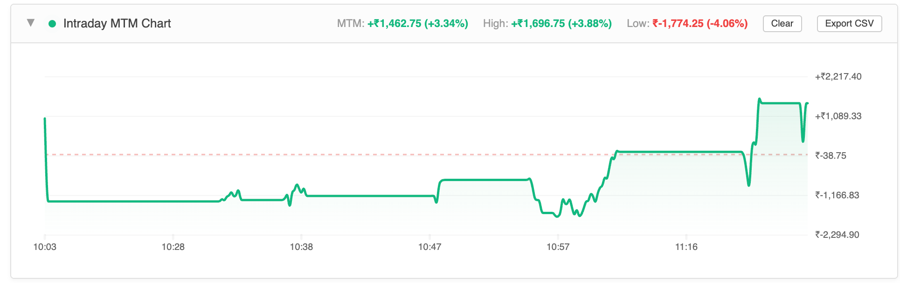

# KitePlus Companion Extension

A premium, lightweight browser extension companion for Zerodha Kite (`kite.zerodha.com`) that adds intraday performance charts, position grouping, and express order baskets locally on your machine.



## Key Features

- **Intraday MTM Line Chart**: Injected directly into the Positions page. Tracks and logs your Net P&L (MTM) every 10 seconds. Calculates High and Low limits in both currency and percentage relative to your capital.
- **Dual-Axis Visualization**: Displays exact currency change (`₹`) on the right Y-axis and percentage change (`%`) on the left Y-axis.
- **Dynamic Theme Awareness**: Detects and adapts to Zerodha Kite's dark and light themes automatically.
- **Direct Margin API Integration**: Fetches real capital data from Zerodha's backend `/api/margins` endpoint asynchronously (no manual Funds tab navigation required).
- **Positions Grouping**: Organizes active positions by underlying symbol or expiry date with nested P&L tracking.
- **Express Baskets**: Build and execute up to 8 F&O leg baskets simultaneously.
- **Option Chain watchlists**: Generates F&O option chains directly within the watchlists.

## Installation (Free / Developer Mode)

1. Clone or download this repository to your local computer:
   ```bash
   git clone https://github.com/UGilfoyle/kite-plus-alternative.git
   ```
2. Open Google Chrome and navigate to `chrome://extensions/`.
3. In the top-right corner, toggle **Developer mode** to **ON**.
4. Click **Load unpacked** in the top-left corner.
5. Select the `kite-plus-alternative` folder from this repository.
6. Open `https://kite.zerodha.com/positions` and enjoy your enhanced dashboard!

## Privacy & Security

This extension runs **100% locally** on your device. 
- No API keys, credentials, or personal information are sent to external servers.
- No analytics or third-party tracking scripts are bundled.
- All capital and margin stats are fetched locally in your active logged-in browser session.
